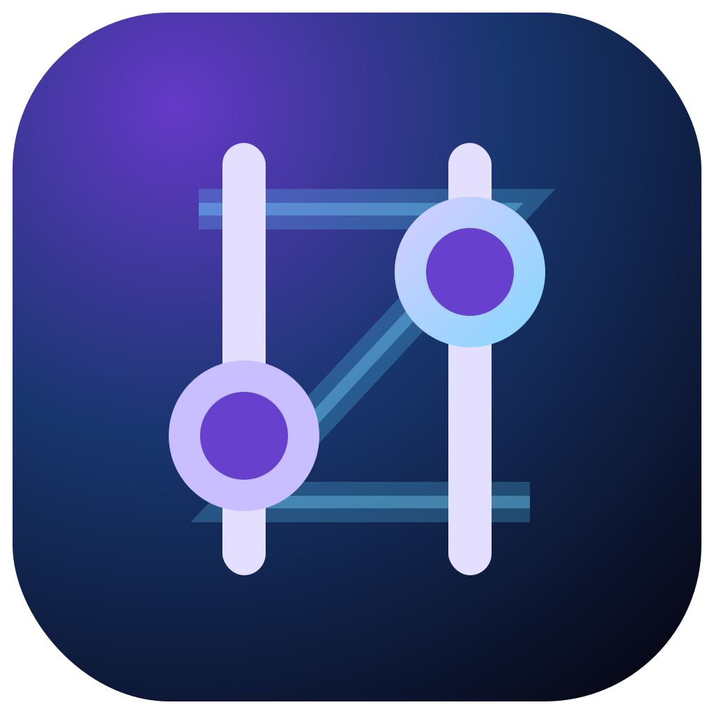

<h1 align="center">
  
  <br>
  RootlessZachDSP
</h1>

<h4 align="center">A reliability-first, system-wide JamesDSP implementation for non-rooted Android devices.</h4>

<p align="center">
  <a href="LICENSE"></a>
  <a href="../../actions/workflows/build.yml"></a>
  
</p>

> [!IMPORTANT]
> **RootlessZachDSP is an independent fork of [RootlessJamesDSP](https://github.com/timschneeb/RootlessJamesDSP), created and maintained by [Tim Schneeberger / ThePBone](https://github.com/timschneeb).** The DSP engine is [JamesDSP / libjamesdsp](https://github.com/james34602/JamesDSPManager), written by [James Fung](https://github.com/james34602). Their work is the foundation of this app. RootlessZachDSP is not an official release from either upstream developer.

## What this app is

RootlessZachDSP captures eligible Android media playback, processes the PCM stream through JamesDSP, and plays the result to the active audio route. It is intended to provide advanced DSP without requiring root while making failures understandable and preserving audible output whenever the full DSP path cannot operate safely.

The fork keeps the upstream equalizers, convolver, compander, crossfeed, bass processing, LiveProg scripting, device profiles, AutoEQ integration, backup system, rootless Shizuku/ADB setup, and root build support. Development in this fork prioritizes transport correctness, recovery, diagnostics, Android 16/17 behavior, and Samsung One UI compatibility.

## Foundation milestone

The first RootlessZachDSP development milestone adds:

- correct handling of partial `AudioRecord.read()` and `AudioTrack.write()` operations;
- bounded zero-progress and platform-error handling;
- underrun, processing deadline, partial-transfer, recovery, and bypass telemetry;
- conservative adaptive buffer growth and stability-based shrink decisions;
- fail-open dry bypass when DSP processing fails or repeatedly misses its deadline;
- wet/dry and restart gain ramps to reduce clicks during recovery;
- recorder/track recovery with retries and backoff;
- an application capture-policy store supporting exclude-selected and allow-selected modes;
- a local, redacted compatibility report scaffold;
- deterministic transport unit tests;
- Android 16 build tooling, NDK r28, 16 KiB alignment verification, signed releases, and SHA-256 checksums.

See [the implementation plan](docs/IMPLEMENTATION_PLAN.md) and [roadmap](docs/ROADMAP.md) for later milestones.

## Android and device targets

Primary validation targets are Android 16 / One UI 8.5, Android 17 / One UI 9, Samsung Galaxy S23 Ultra, Pixel reference devices, and speaker, wired, Bluetooth, USB, HDMI, and DeX routes.

Compatibility does **not** mean every app can receive full JamesDSP processing. Android and source applications can prohibit playback capture, native/exclusive audio paths can bypass the capture API, and work/private profiles are separate users. RootlessZachDSP classifies outcomes as **Full DSP**, **Limited fallback**, **Clean bypass**, or **Capture unavailable**, instead of silently promising universal capture.

## Privacy

The release workflow builds the `rootlessFdroid` flavor. It does not include Firebase Analytics or Crashlytics. Compatibility reports are generated locally and redact selected package names unless the user explicitly includes them. Optional anonymized compatibility contributions are a future opt-in feature and will not be enabled by default.

## Package identity

The installed rootless application ID is `com.zfkirke0109.rootlesszachdsp`. The source namespace remains at the upstream value during the first transport-focused pull request to keep functional changes reviewable; a separate mechanical migration will move source packages without mixing high-churn renames into audio-engine work.

## Build and signing

```bash
git submodule update --init --recursive
./gradlew testRootlessFdroidDebugUnitTest
./gradlew assembleRootlessFdroidDebug
```

Release signing is configured only when `GH_RELEASE_KEYSTORE_PATH`, `GH_RELEASE_STORE_PASSWORD`, `GH_RELEASE_KEY_ALIAS`, and `GH_RELEASE_KEY_PASSWORD` are supplied. GitHub Actions materializes the key from the encrypted `GH_RELEASE_KEYSTORE_BASE64` repository secret only for manual or tagged release builds. The keystore and passwords must never be committed. Manual runs produce verified signed artifacts; only `v*` tags publish a GitHub Release. Both paths verify the APK signature, 16 KiB ZIP alignment, and SHA-256 sums.

## Credits

- **RootlessJamesDSP application and rootless architecture:** [Tim Schneeberger / ThePBone](https://github.com/timschneeb)
- **JamesDSP and libjamesdsp:** [James Fung](https://github.com/james34602)
- **Upstream translators and contributors:** retained in repository history and translation files
- **Theming and backup foundations:** based on work credited by upstream to Tachiyomi
- **RootlessZachDSP fork direction and validation:** Zach Kirke / Zfkirke0109

The new icon intentionally retains the upstream project's recognizable two-slider visual language while using an original dark galaxy, purple/cyan, and subtle Z signal-path design.

## License

RootlessZachDSP remains licensed under the GNU General Public License v3.0. See [LICENSE](LICENSE). Copyright and attribution notices for upstream code must remain intact.
